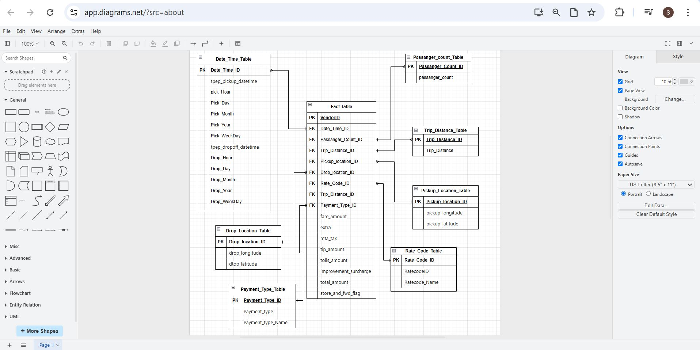

# Uber Data Analytics Pipeline

An end-to-end data engineering project on NYC Yellow/Green Taxi trip records — from raw CSV ingestion to a live Looker Studio dashboard. Built on Google Cloud using Mage for orchestration, BigQuery as the data warehouse, and a star schema dimensional model designed for analytical querying.

📊 [Dashboard PDF](Output/Final%20Dashboard/Uber_Dashboard.pdf)

---

## Why I Built This

I wanted hands-on experience building a real data engineering pipeline — not a toy tutorial, but something that actually touches cloud infrastructure, orchestration, data modeling, and visualization end to end. NYC taxi data was a good fit: it's messy, large enough to be interesting, and has enough dimensions to make modeling worthwhile.

---

## Architecture

```
NYC TLC Raw CSV (Source)
        │
        ▼
Google Cloud Storage         ← raw data staging
        │
        ▼
Google VM (Compute Engine)   ← Mage deployed here
        │
    ┌───┴────────────────────┐
    │     Mage ETL Pipeline  │
    │  [Loader] → [Transformer] → [Exporter]
    └───────────────────────-┘
        │
        ▼
Google BigQuery              ← star schema data warehouse
        │
        ▼
Looker Studio Dashboard      ← live connected to BigQuery
```

---

## Data Model — Star Schema

The raw flat file was restructured into a dimensional model with 1 fact table and 7 dimension tables.



| Table | Type | Description |
|-------|------|-------------|
| `fact_table` | Fact | Trip-level records — fare, tip, vendor, keys to all dims |
| `datetime_dim` | Dimension | Pickup/dropoff timestamps broken into hour, day, month, weekday |
| `passenger_count_dim` | Dimension | Passenger count per trip |
| `trip_distance_dim` | Dimension | Trip distance |
| `rate_code_dim` | Dimension | Rate code mapped to descriptive labels |
| `payment_type_dim` | Dimension | Payment method (credit card, cash, etc.) |
| `pickup_location_dim` | Dimension | Pickup lat/long coordinates |
| `dropoff_location_dim` | Dimension | Dropoff lat/long coordinates |

This structure dramatically improves query performance and makes the dashboard layer clean and flexible.

---

## Mage ETL Pipeline

Mage was deployed on a Google Compute Engine VM and used as the orchestration layer with 3 modular blocks:

**Loader** — pulls raw CSV from Google Cloud Storage into a Pandas DataFrame


**Transformer** — handles all data transformation logic:
- Type conversion (object → datetime)
- Date breakdown into hour, day, month, weekday components
- ID code mapping to descriptive labels (e.g., payment type names)
- Duplicate removal and surrogate key generation
- Restructuring into fact + dimension tables


**Exporter** — loads all transformed tables into BigQuery


**Pipeline Tree View**


---

## Dashboard

Built in Looker Studio connected live to BigQuery. 

📊 [Open Live Dashboard](https://lookerstudio.google.com/s/ry5lrPQj4No)


---

## Tech Stack

| Layer | Tool |
|-------|------|
| Data Source | NYC TLC Trip Records |
| Cloud Storage | Google Cloud Storage (GCS) |
| Compute | Google VM (Compute Engine) |
| Orchestration | Mage (open-source ETL) |
| Transformation | Python (Pandas) |
| Data Warehouse | Google BigQuery |
| Visualization | Looker Studio |

---

## Project Structure

```
uber-data-analytics/
├── Code/
│   ├── Uber_Data_Analysis.ipynb          # EDA and transformation notebook
│   ├── uber_data_loader.py.txt           # Mage loader block
│   ├── uber_data_transformer.py.txt      # Mage transformer block
│   ├── uber_bigquery_exporter.py.txt     # Mage exporter block
│   ├── BigQuery_Table_Creation_query.sql # BigQuery schema creation
│   └── Star_Schema.drawio                # Star schema diagram source
├── Output/
│   ├── Final Dashboard/
│   │   └── Uber_Dashboard.pdf
│   ├── Mage Screenshots/                 # Pipeline step screenshots
│   └── StarSchemaStructure.JPG
├── Project Document/
│   └── Uber Data Analytics Project Report.docx
├── Source/
│   └── uber_data.csv
└── README.md
```

---

## Errors I Hit & Fixed

**1. Protobuf Version Mismatch**
```
Error: Detected mismatched Protobuf Gencode/Runtime major versions
Fix:   pip install --upgrade protobuf==6.30.2
```

**2. Missing db-dtypes Package**
```
Error: ValueError: Please install the 'db-dtypes' package to use this function
Fix:   pip install db-dtypes
```

Documenting errors and fixes is part of real engineering — if you hit these, now you know.

---

## Dataset

- **Source:** [NYC TLC Trip Record Data](https://www.nyc.gov/site/tlc/about/tlc-trip-record-data.page)
- **Data Dictionary:** [Yellow Taxi Trip Records](https://www.nyc.gov/assets/tlc/downloads/pdf/data_dictionary_trip_records_yellow.pdf)
- Fields include: pickup/dropoff timestamps, locations, trip distance, passenger count, rate codes, payment types, fare metrics

---

## What I'd Add Next

- Automate daily ingestion using Cloud Scheduler + Mage triggers
- Add dbt models on top of BigQuery for reusable transformation logic
- Expand dashboard with time-series anomaly detection on fare trends
- Integrate with real-time NYC TLC API feed instead of batch CSV

---

## Author

**Suyog Desai** — [GitHub](https://github.com/Suyog-Desai) · [LinkedIn](https://linkedin.com/in/suyog-desai) · [Portfolio](https://suyogdesai.framer.website)
